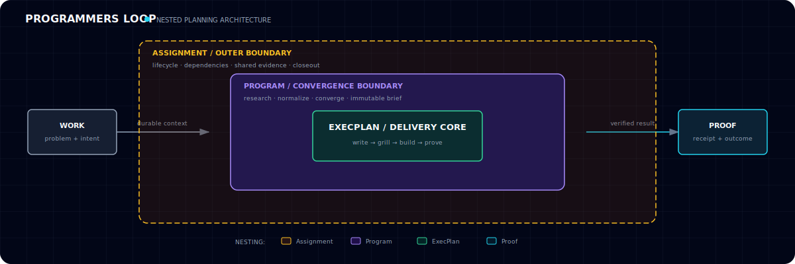
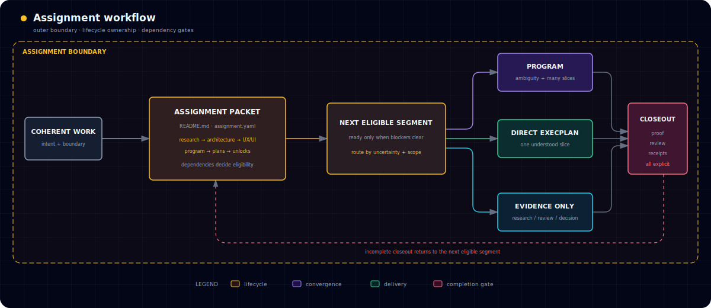
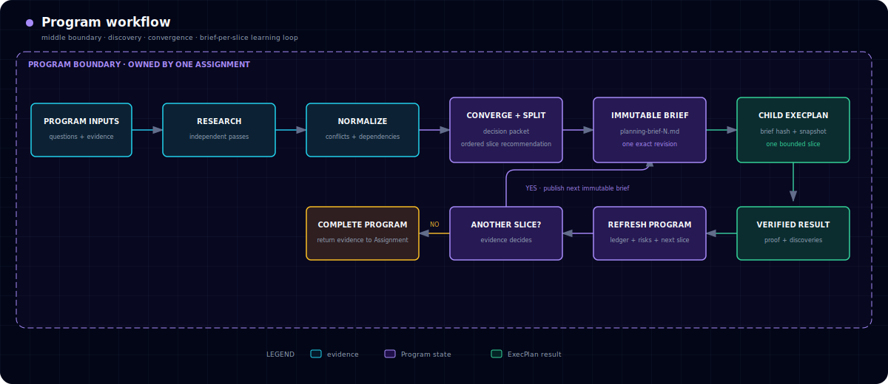
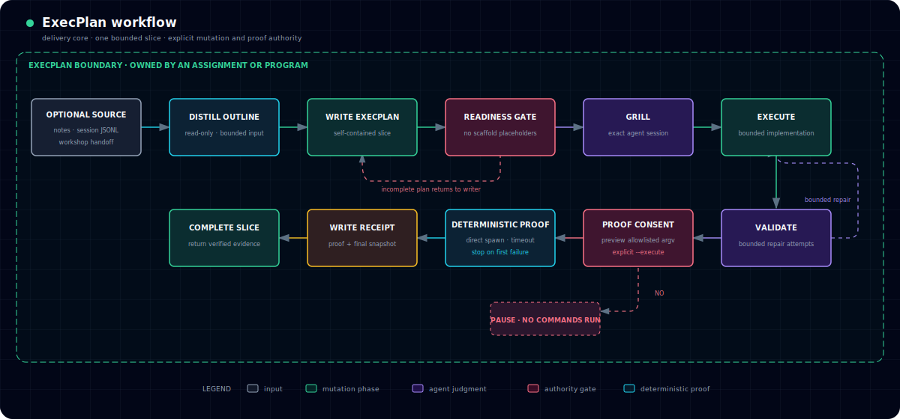

# Programmers Loop



**Give any coding model a durable loop: plan → critique → build → prove.**

## See it work in 60 seconds

Requires [Node 24 or newer](https://nodejs.org/) and
[Bun 1.3.14](https://bun.sh/).

```bash
git clone https://github.com/ParkerRex/programmers-loop.git
cd programmers-loop
bun install --frozen-lockfile
bun run demo
```

The demo diagnoses the local setup, walks a completed
`Assignment → Program → ExecPlan`, validates its contracts, and previews its
allowlisted proof command. It does not invoke an agent, execute proof, or change
the repository.

## Pick your loop

- **Tiny, obvious edit?** Skip durable planning.
- **One clear feature?** Use an Assignment with a standalone ExecPlan.
- **Messy, multi-step project?** Use an Assignment with a Program and child
  ExecPlans.

<details>
<summary><strong>Author's note</strong></summary>

I built Programmers Loop while using GPT-5.5 with `xhigh` reasoning to build
extremely complex software. It began with OpenAI's
[PLANS.md / ExecPlan primitive](https://developers.openai.com/cookbook/articles/codex_exec_plans)
and the planning approach in
[Modernizing your Codebase with Codex](https://developers.openai.com/cookbook/examples/codex/code_modernization).
I expanded that foundation into a larger development lifecycle: an Assignment
is the parent work packet and can step through research, user experience,
design, architecture, and delivery; a Program converges that work and
orchestrates the ExecPlans that implement it. This repository packages that
system so other people can study it, adapt it, and get more reliable work from
coding models at every capability and price point.

</details>

Programmers Loop is a small, agent-neutral Node runtime for turning coding-agent
work into durable plans, bounded implementation, and deterministic proof.

## Why this exists

The most capable frontier models can often hold an entire implementation in
context and improvise a good development process as they go. With those models,
an explicit orchestration layer can feel unnecessary.

That changes quickly with cheaper models, long-running work, handoffs, failures,
and context loss. The model may still be capable of writing the code, but it
benefits enormously when the repository provides the memory and discipline:

- what problem is being solved;
- which decisions are settled;
- what belongs in the current slice;
- how to recover when execution stops; and
- what observable evidence counts as done.

Programmers Loop externalizes those habits into versioned artifacts, concise
skills, checked-in prompts, validators, and doctors. The goal is not to make a
smaller model magically smarter. It is to give that model a better workbench—and
to make the development loop inspectable, teachable, and portable between
agents.

## The three nested workflows

Think of the system as nested boundaries rather than one enormous flowchart.
The Assignment is the outer lifecycle, a Program is the optional convergence
loop inside it, and an ExecPlan is the smallest delivery core.

### Assignment — the outer boundary

The Assignment owns the coherent body of work, routes eligible lifecycle
segments, and refuses completion until proof, review, and receipts agree.



### Program — the convergence boundary

A Program is added only when uncertainty or multiple ordered slices require
research, convergence, immutable briefs, and learning between ExecPlans.



### ExecPlan — the delivery core

An ExecPlan turns one understood slice into a self-contained plan, critiques it
in the exact agent session, executes bounded work, and separates agent judgment
from explicitly authorized deterministic proof.



Everything important is checked into Git. Chat history and model memory are
helpful, but neither is the source of truth.

## When to use what

- Skip durable planning for a trivial, low-risk edit with no handoff or recovery
  need.
- Use an **Assignment** alone for a coherent research, review, or decision
  packet.
- Add a standalone **ExecPlan** when the outcome is understood and fits one
  bounded implementation slice.
- Add a **Program** when the work is ambiguous, dependency-heavy, or needs
  several ordered ExecPlans that learn from one another.

The [artifact anatomy and selection guide](docs/assignments/artifact-guide.md)
shows the complete file trees for a real-world completed Assignment, Program,
and ExecPlan, generalized from source-repository history.

## What is included

- Assignment, Program, and ExecPlan contracts and scaffolds.
- A generalized Assignment lifecycle stepper across research, architecture,
  UX, UI, Programs, ExecPlans, external unlocks, proof, review, and receipts.
- Focused and repository-wide planning validators.
- Separate structural and execution-readiness validation, so scaffold evidence
  cannot authorize implementation.
- A provider-neutral `AgentAdapter`, with a Codex CLI adapter first.
- Read-only local and GitHub doctors plus an active-work standup.
- Reusable skills for workshop, planning, execution, docs, diagnosis, and proof.
- Checked-in Program and ExecPlan prompt loops.
- Explicit-consent agent phases and deterministic proof with safe command
  preview, direct spawning, timeouts, bounded output, repair limits, and
  receipts.
- Idempotent Program child-plan runs with immutable brief snapshots and
  one-transition Program diff enforcement.
- Full semantic Program and ExecPlan prompt contracts, including read-only
  outline distillation from notes, exact Codex session JSONL, or a workshop
  handoff, plus same-session grilling.
- Separate ExecPlan structural and readiness gates, optional outline-driven
  writing in the complete run, and final child-plan snapshots.
- An enforced Markdown documentation spine.
- Human-readable output, stable JSON, dry runs, path containment, and explicit
  CLI exit codes.

The runtime targets Node 24 or newer. Bun 1.3.14 is the sole package manager and
script launcher.

## Use it on your work

Preview a first packet without changing anything:

```bash
bun run cli -- assignment create \
  --slug my-project \
  --title "My project" \
  --dry-run
```

Then explore the interface:

```bash
bun run cli -- --help
bun run cli -- standup
bun run cli -- skills list
bun run cli -- prompts list
bun run cli -- exec-plan outline --input <notes.md> --output <outline.md>
bun run cli -- exec-plan outline --session-jsonl <session.jsonl> --output <outline.md>
bun run cli -- exec-plan proof --path <plan.md>
```

The complete command and output contract lives in the
[CLI reference](docs/CLI.md). Start with the
[documentation index](docs/index.md) for architecture, planning contracts,
development, reliability, and security.

## Status

The portable contracts, strict validators, Assignment stepper, Program and
ExecPlan loops, complete semantic prompt pack, documentation spine, doctors,
standup, deterministic proof boundary, and durable runtime receipts are
implemented and dogfooded here. The
[extraction boundary](docs/EXTRACTION.md) records source parity and intentional
application extension points.

Valid Markdown never implies permission to execute its commands. Proof preview
is read-only; execution requires explicit consent and remains constrained by
configured token prefixes, repository containment, direct process spawning,
timeouts, bounded output, and durable receipts.

## Measuring it: LoopBench

The harness ships with an evaluation program, internally codenamed LoopBench.
The thesis: Programmers Loop turns a coding model into a compounding system —
curated skills, enforced structure, and failure-driven adaptation convert
capability into verified finished work at falling cost per success. The
benchmark measures verified work per dollar against the vendor's own harness,
preregistered before any scored run, with hidden graders counting verified
successes and a published analysis plan. Start with the
[thesis explainer](docs/evals/THESIS.md), then read the
[preregistration](docs/evals/PREREGISTRATION.md).

## License

[MIT](LICENSE)
